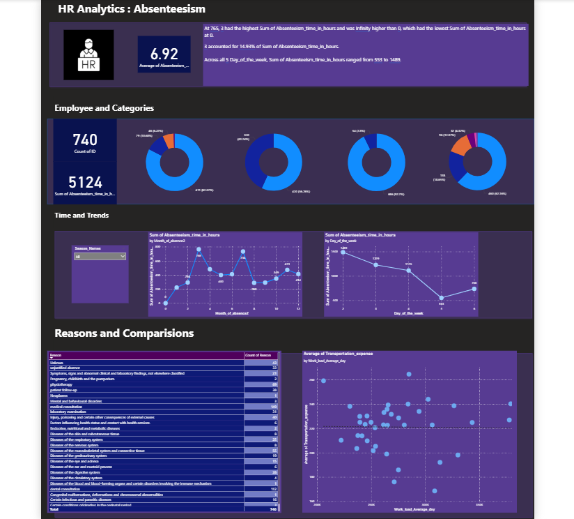

# 💼 HR Employee Health & Absenteeism Analysis

Analyzing employee health and absenteeism using SQL and Power BI to support HR decisions on bonuses, wage increases, and absenteeism management.

---

<!-- Table of Contents (HTML links) -->
<nav>
  <h2>📑 Table of Contents</h2>
  <ul>
    <li><a href="#project-overview">📘 Project Overview</a></li>
    <li><a href="#business-problem">🎯 Business Problem</a></li>
    <li><a href="#dataset">🗂️ Dataset</a></li>
    <li><a href="#tools--technology">🛠️ Tools & Technology</a></li>
    <li><a href="#folder-structure">📁 Folder Structure</a></li>
    <li><a href="#data-cleaning--preparation">🧹 Data Cleaning & Preparation</a></li>
    <li><a href="#exploratory-data-analysis-eda">🔍 Exploratory Data Analysis (EDA)</a></li>
    <li><a href="#power-bi-dashboard-overview">📊 Power BI Dashboard Overview</a></li>
    <li><a href="#key-insights">⭐ Key Insights</a></li>
    <li><a href="#references">📚 References</a></li>
    <li><a href="#author--contact">👤 Author & Contact</a></li>
  </ul>
</nav>

---

<h2 id="project-overview">📘 Project Overview</h2>

This project analyzes employee health and absenteeism using SQL and Power BI to help HR make data-driven decisions. It identifies the healthiest employees eligible for bonuses and calculates wage increases for non-smokers. The data is transformed using SQL queries with JOINs, filters, and CASE statements. An interactive Power BI dashboard provides insights on absenteeism trends, demographics, and health patterns.

---

<h2 id="business-problem">🎯 Business Problem</h2>

The HR department needed a solution to manage employee absenteeism and promote healthier habits. Specifically, they wanted to:

- Identify healthy employees with low absenteeism to reward them with a **$1,000 bonus**.  
- Calculate a **wage increase for non-smokers** within a fixed insurance budget.  
- Create an interactive **dashboard** to monitor absenteeism trends and employee health metrics efficiently.

---

<h2 id="dataset">🗂️ Dataset</h2>

The project uses three datasets imported into SQL Server:

- **absenteeism at work** – Main employee table with absence hours, reasons for absence (codes), BMI, and social habits (smoker/drinker).  
- **reasons** – Dictionary linking numerical absence codes to text descriptions.  
- **compensation** – Employee salary and compensation details.  

All datasets are in **CSV format** and were cleaned and transformed before analysis.

---

<h2 id="tools--technology">🛠️ Tools & Technology</h2>

- **SQL Server Studio** – Database creation, data import, transformation, and query development.  
- **Power BI** – Interactive dashboard for absenteeism analysis.  
- **SQL** – JOINs, filtering, subqueries, CASE statements for data preparation.

---

<h2 id="folder-structure">📁 Folder Structure</h2>

```bash
HR_Employee_Health_Absenteeism_Project/
│
├── data/ # Contains raw CSV datasets
│   ├── absenteeism_at_work.csv
│   ├── reasons.csv
│   └── compensation.csv
│
├── images/ # Screenshots or visuals used in the project
│
├── dashboard/ # Power BI dashboard file
│
├── report/ # Project report or documentation
│
├── README.md # Project README file
└── .gitignore # Git ignore file


```
<h2 id="data-cleaning--preparation">🧹 Data Cleaning & Preparation</h2>

  - **Handled missing values** – Checked for and addressed any null or missing entries in the datasets.
- **Standardized column names** – Ensured consistent naming conventions across tables for easier SQL joins.
- **Data type corrections** – Converted columns like dates, numeric fields, and categorical flags to appropriate data types.
- **Merged datasets** – Created a **master table** by joining absenteeism at work, reasons, and compensation tables using employee ID and absence reason codes.
- **Categorization** – Added derived columns using SQL CASE statements for BMI categories and seasonal grouping of absences.

---
<h2 id="exploratory-data-analysis-eda">🔍 Exploratory Data Analysis (EDA)</h2>

The EDA phase involved analyzing employee absenteeism, health habits, and compensation to uncover key insights:

**Healthiest Employees Identification**
- Filtered employees based on non-smoker, non-drinker, BMI < 25, and below-average absenteeism.
- Resulted in a highly selective bonus-eligible cohort of **11 employees**.

**Non-Smoker Wage Increase Calculation**
- Counted **686 non-smoker employees**.
- Calculated total annual work hours: 686 × 2080 ≈ 1.43 million hours.
- Derived hourly wage increase: $983,221 ÷ 1,426,880 ≈ $0.68/hour.
- Computed annual increase per employee: $0.68 × 2080 ≈ $1,414.40.

**Correlation Analysis**
- Used scatter plots to explore relationships such as **Transportation Expense vs. Workload** to detect patterns affecting absenteeism.

**Categorical Analysis**
- Applied CASE statements to group employees by BMI categories: Underweight, Healthy Weight, Overweight, Obese.
- Grouped absences by **seasons** (Winter, Spring, Summer, Fall) to identify trends.

**Visualization-Ready Data**
- Final SQL query selected only relevant columns and included derived categories for smooth integration with Power BI.

This EDA prepared the foundation for the interactive Power BI dashboard, enabling HR to analyze absenteeism trends, demographic patterns, and health insights efficiently.

---
<h2 id="power-bi-dashboard-overview">📊 Power BI Dashboard Overview</h2>

  - **Main KPI:** Average Absenteeism in Hours (Card Visual) – Highlights overall absenteeism.
- **Secondary KPIs:** Number of Employees (Count) and Total Hours of Absence (Sum).
- **Distributions:** Pie/Donut Charts for Education, Pets, Children, and BMI categories.
- **Trended Breakdown:** Line Chart of Absentee Hours by Month.
- **Filters & Slicers:** Seasons and demographic/health filters.
- **Table Breakdown:** Count of Absence Reasons.
- **Scatter Plot:** Transportation Expense vs. Average Workload.
- **Narrative Visual:** Power BI Smart Narrative for automated textual summaries.

The dashboard enables HR to **monitor absenteeism trends, track healthy employee programs, and make informed decisions efficiently**.



---
<h2 id="key-insights">⭐ Key Insights</h2>

1️⃣ **Healthy Employee Bonus Program Reveals Very Low Eligibility**  

- Only 11 employees qualified under the health and attendance criteria.  
**Insight:** A very small portion meets the company’s wellness and attendance standards, highlighting areas HR should evaluate.

2️⃣ **Majority of Employees Fall Short on At Least One Health or Lifestyle Metric**  
- Large segments either have BMI above healthy range, consume alcohol or smoke, or have above-average absenteeism.  
**Insight:** Opportunity for wellness initiatives and targeted support.

3️⃣ **Budget Reallocation Creates a Strong Employee Benefit**  
- $983,221 distributed across 686 non-smokers:  
  - Annual raise per employee: $1,414.40  
  - Hourly equivalent: $0.68  
**Insight:** Cost savings can convert into meaningful employee compensation benefits.

4️⃣ **Demographic Factors Show Clear Patterns in Absenteeism**  
- Education levels, family responsibilities, and age groups affect absenteeism. Seasonal trends are also observed.  
**Insight:** HR can forecast shortages and plan interventions based on these patterns.

5️⃣ **Lifestyle Habits Strongly Correlate With Absence**  
- Smokers and drinkers tend to have higher absenteeism.  
**Insight:** Supports investment in wellness and preventive health programs.

6️⃣ **BMI Distribution Indicates Long-Term Health Risks**  
- Large portion of workforce is Overweight or Obese.  
**Insight:** Early wellness programs could mitigate future absenteeism and insurance costs.

---
<h2 id="references">📚 References</h2>
- [Public hotel booking dataset](https://absentdata.com/data-analysis/where-to-find-data)

---
<h2 id="author--contact">👤 Author & Contact</h2>
**Shreeganesh Bhat** – Data Analyst  
- **Email:** shriganeshbhat0@gmail.com  
- **LinkedIn:** [https://www.linkedin.com/in/shreeganesh-bhat-8a8184398](https://www.linkedin.com/in/shreeganesh-bhat-8a8184398)  
- **GitHub:** [https://github.com/shriganeshbhat0-git](https://github.com/shriganeshbhat0-git)


